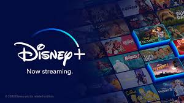

# Disney Plus

For all Disney-content lovers, [**Disney plus**]() is one unique stop for them.  It presents all the content from **Disney, Pixar, Marvel, Star Wars, National Geographic and Star** which fascinates a large no. of viewers. You can enjoy range of TV Shows and movies on this platform. Besides, this interface is supported by a range of devices. 

Above all , what is more interesting to note is  - each family member can watch on [**Disney plus**]() with individual profiles to get personalised content. The streaming can be made on 4 separate device for different content. As a matter of fact, this makes it more relishing. 

## Get ready to Setup Disney Plus account

1. Fire up your device and go to its browser.
2. Search for [**Disney plus**]() on it.
3. Tap sign-in button on the screen displayed.
4.  Then login windoww appears.You can do so via  - Phone no. ,  Email or Facebook account.
5. Lastly, your account sign-up is done.

## Method to cancel Disney plus account

1. Start by logging in [**Disney plus**]() account.
2. Then go to your Profile.
3. Reach Disney Plus  account settings.
4. Tap subscription you have **>**  **'Cancel subscription’**.
5. Tap **‘continue to cancel’** on  ‘why you want to cancel subscription’ box.
6. Now your membership is cancelled.

## **For more information:-**
Disney Plus

